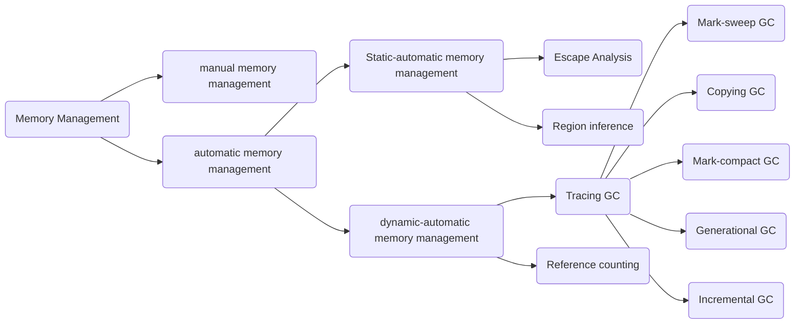
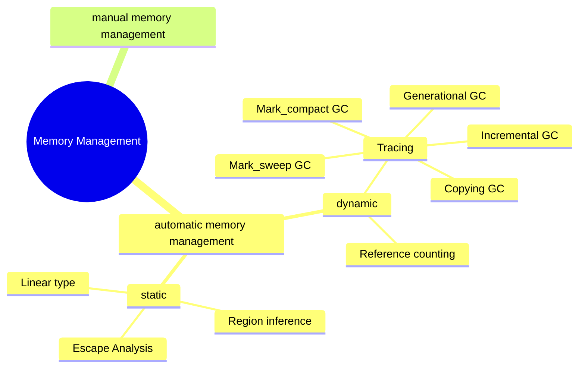

```mermaid
flowchart LR

A(Memory Management) --> B(manual memory management)
A --> C(automatic memory management)
C --> SA(Static-automatic memory management)
SA --> EA(Escape Analysis)
SA --> RI(Region inference)
C --> D(dynamic-automatic memory management)
D --> T(Tracing GC)
D --> R(Reference counting)
T --> M(Mark-sweep GC)
T --> CP(Copying GC)
T --> MC(Mark-compact GC)
T --> GGC(Generational GC)
T --> IGC(Incremental GC)
```

```mermaid
mindmap
  root((Memory Management))
    automatic memory management
      dynamic
        Tracing
          Mark_sweep GC
          Copying GC
          Mark_compact GC
          Generational GC
          Incremental GC
        Reference counting
      static
        Escape Analysis
        Region inference
        Linear type
    manual memory management
```

