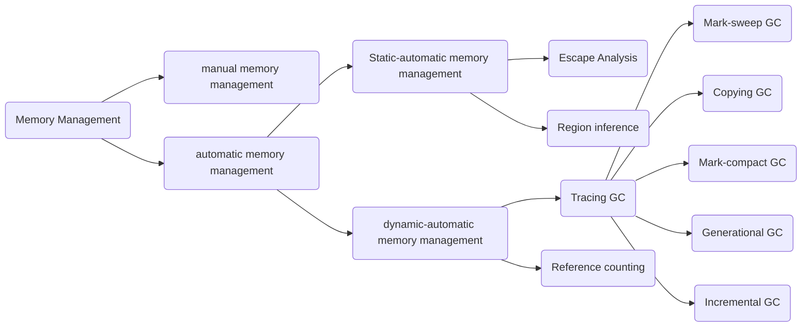
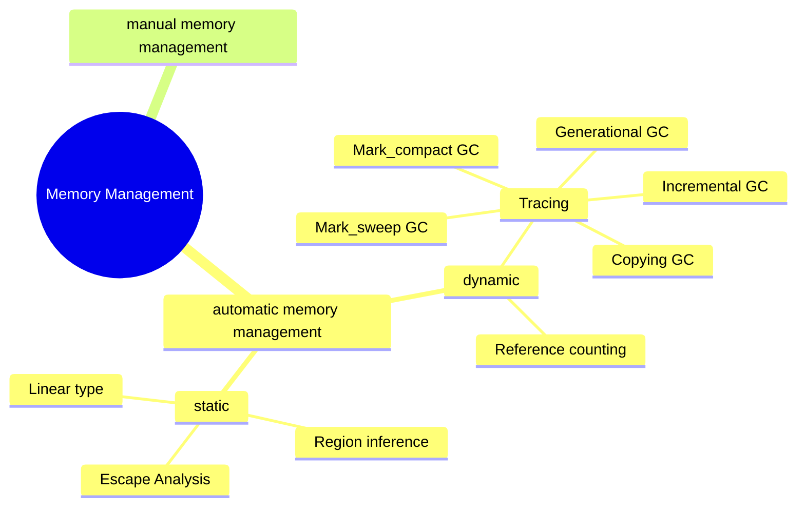

# メモリ管理

このドキュメントでは、メモリ管理の方法論について調べたことをまとめていく。

メモリ管理の方法論は以下のようなダイアグラムにまとめられる。

プログラム実行中のメモリ構造
- スタックには、局所変数や関数呼び出しの履歴などが格納される。関数呼び出しが起こると伸びて、returnが起こると縮む
- 大域変数を格納する領域が用意される。定数が格納される領域も独立に用意される場合が多い
- レジスタは、関数の引数、計算の途中結果など様々な値をとる。オブジェクトを指すポインタの可能性もある。
- ヒープは自由な順番でメモリ領域を確保/解放できる領域である。オブジェクト作成を行うと、ヒープの中に必要な大きさの領域が確保される。
- プログラムのコード領域もある。

オブジェクトは基本ヒープに作られて、なぜかというと関数内で作ったオブジェクトをそのまま返すことがあるからである。スタックに作ってしまうと、returnと同時に消えるのでこのようなケースに対応できない。
（もちろんこんなに単純ではないと思うが、イメージとしてはこう）

手動でいらないオブジェクトを解放するのはメモリリークや脆弱性の元となるので、自動でこれを行うGCが求められる。

# 手動メモリ管理

allocate + 手動 free はCやC++といったGCのない言語におけるメモリ管理であり、オブジェクトの確保・解放のタイミングをプログラムが決める手法である。

メモリの確保 = nバイトのメモリ領域を確保し、アドレスを返す

- fragmentation: 小さい空き領域がメモリ上で飛び飛びにあること
- coalescing: 連続した空き領域ができた時、それらを一つの空き領域にまとめること
- header: ユーザが使うメモリ領域/空き領域の一つ一つに対して管理情報が必要であり、それらの管理情報を、オブジェクトの最初のワードの直前に配置するシステムが多い。その管理領域を　header と呼ぶ。例えばオブジェクトサイズや次の空き領域のポインタなどが含まれる。

# Reference Counting

**どこかからポインタで指されているオブジェクトは、将来使い道がある**

1. 

# 参考文献

一般教養としての Garbage Collection
