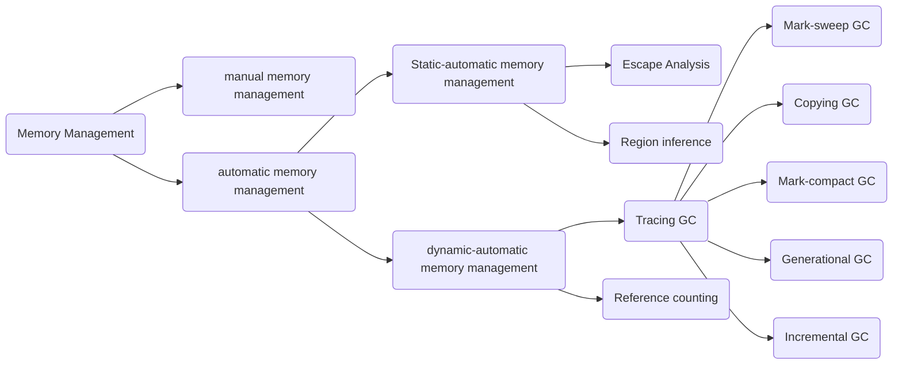
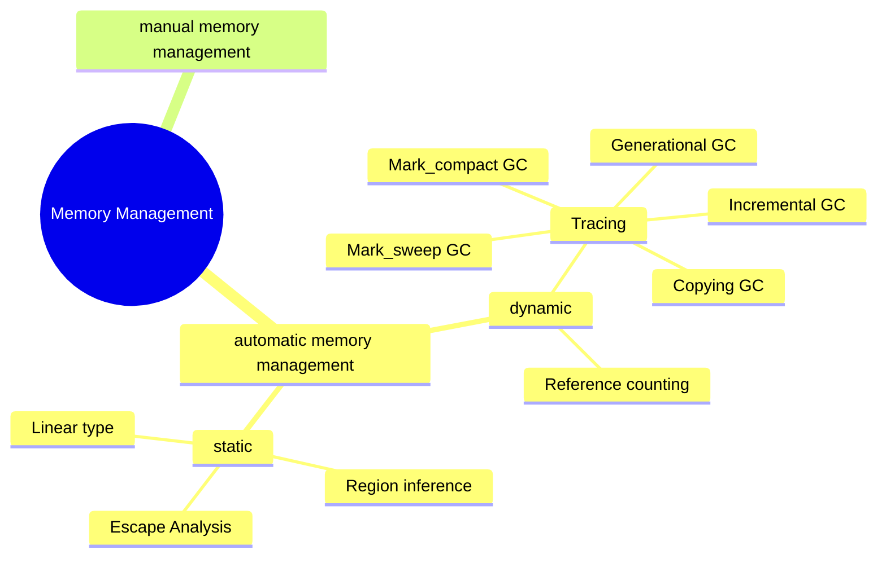

# メモリ管理

このドキュメントでは、メモリ管理の方法論について調べたことをまとめていく。

メモリ管理の方法論は以下のようなダイアグラムにまとめられる。

プログラム実行中のメモリ構造
- スタックには、局所変数や関数呼び出しの履歴などが格納される。関数呼び出しが起こると伸びて、returnが起こると縮む
- 大域変数を格納する領域が用意される。定数が格納される領域も独立に用意される場合が多い
- レジスタは、関数の引数、計算の途中結果など様々な値をとる。オブジェクトを指すポインタの可能性もある。
- ヒープは自由な順番でメモリ領域を確保/解放できる領域である。オブジェクト作成を行うと、ヒープの中に必要な大きさの領域が確保される。
- プログラムのコード領域もある。

オブジェクトは基本ヒープに作られて、なぜかというと関数内で作ったオブジェクトをそのまま返すことがあるからである。スタックに作ってしまうと、returnと同時に消えるのでこのようなケースに対応できない。
（もちろんこんなに単純ではないと思うが、イメージとしてはこう）

手動でいらないオブジェクトを解放するのはメモリリークや脆弱性の元となるので、自動でこれを行うGCが求められる。

# 手動メモリ管理

allocate + 手動 free はCやC++といったGCのない言語におけるメモリ管理であり、オブジェクトの確保・解放のタイミングをプログラムが決める手法である。

メモリの確保 = nバイトのメモリ領域を確保し、アドレスを返す

- fragmentation: 小さい空き領域がメモリ上で飛び飛びにあること
- coalescing: 連続した空き領域ができた時、それらを一つの空き領域にまとめること
- header: ユーザが使うメモリ領域/空き領域の一つ一つに対して管理情報が必要であり、それらの管理情報を、オブジェクトの最初のワードの直前に配置するシステムが多い。その管理領域を　header と呼ぶ。例えばオブジェクトサイズや次の空き領域のポインタなどが含まれる。

# Reference Counting

**どこかからポインタで指されているオブジェクトは、将来使い道がある**

1. あるオブジェクト a の参照数が正の時は、a は将来使われるかもしれないのでとっておく
2. やがて a の参照数が 0 になったら、そのオブジェクト a は今後の使い道がないとみなし、それを解放する

以下のような欠点がある

- オブジェクトへのポインタや参照が増減するたびに余計な処理をするので、ユーザプログラムの実行時間が遅くなりがち
- オブジェクトのサイクルができると解放できなくなる。たとえば a が b を指し、b が a を指すとする。プログラムの他の部分がa,bへのポインタを一切持っていない場合でも、a も　b も参照数が 0 にならずにいつまでも解放できない

MLやJava処理系ではあまり使われていないが、tracing GC に比べて停止時間が比較的短いため、トータルでの実行速度よりもリアルタイム性の方が重要なスクリプト言語などでは使われる場合もある。

1つ目の欠点については、deferred reference counting アルゴリズムが提案されていて、以下の処理を行う。

- ルート（スタック/レジスタ/大域変数）からオブジェクトへのポインタと、オブジェクトからオブジェクトへのポインタを区別し、後者のみ記録する
  - ルートは書き換え頻度が非常に高いから
- 一定の期間でルートをスキャンし、ルートから直接参照されておらず参照数0のオブジェクトのみを解放する

2つ目の欠点については、

1. 普段は reference counting を用い、ヒープが満杯になってきたら tracing GC を起動する
2. ゴミサイクルではないか？と思われる候補を見つけたら、それを trace して他所から参照されていないことを確かめ、解放する

# Deferred Reference Counting

# Tracing GC

**サイクルでも解放できる**

Reference counting ではオブジェクトの生死判定をいわば「局所的に」行っていた

オブジェクト o の生死判定をするには、o へのポインタ増減を見張っていればよかった。この方式にはサイクルがあると開放できないので困るという欠点がある。

- Tracing GC はより大域的に生死判定を行う手法である。ヒープ全体を見渡して、全オブジェクトの生死判定を一気に行う。
  - なので、reference counting と動作タイミングが異なる
- ヒープが満杯になるまでは allocate を続け、満杯になった時にヒープ中のゴミオブジェクトを一気に検出して解放する

## 生死判定

- ユーザプログラムが現在直接触れるメモリ領域(レジスタ、スタック、大域変数などで、これらをGCのルートと呼ぶ)からポインタによって指されるオブジェクトは生きている
- 生きたオブジェクトからポインタによって指されるオブジェクトは生きている
- それ以外のオブジェクトはゴミであり、解放されるべきである

## お気持ち

オブジェクトを消しても問題が怒らない = ユーザプログラムが将来アクセスしそうなオブジェクトはすべて保持されている

- ルートから到達可能か否かという情報を使うので、サイクルを検知できる
- tracing GC の主な仕事は、ルートからポインタによって到達可能なオブジェクトを再帰的に探索
  - たどられたオブジェクトは何らかの方法で区別する
- 探索には単純な allocate/free 処理よりもずっと長い時間が必要なため、ユーザプログラムを止めてしまう

## Mark-Sweep GC

最古の tracing GC アルゴリズム

マークフェーズ

1. GC開始時には全オブジェクトのマークビットを0で初期化
2. ルートオブジェクトから到達可能なオブジェクトのマークビットを1にする
マークスタックというデータ構造を用いる

スイープフェーズ

ヒープ中の全オブジェクトのマークビットを調べ、0であるオブジェクトをfreeする

# 参考文献

一般教養としての Garbage Collection
